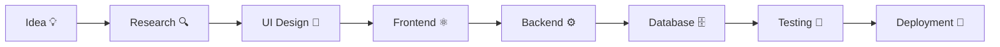
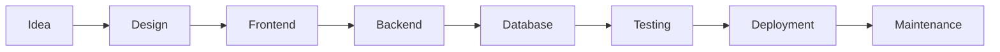
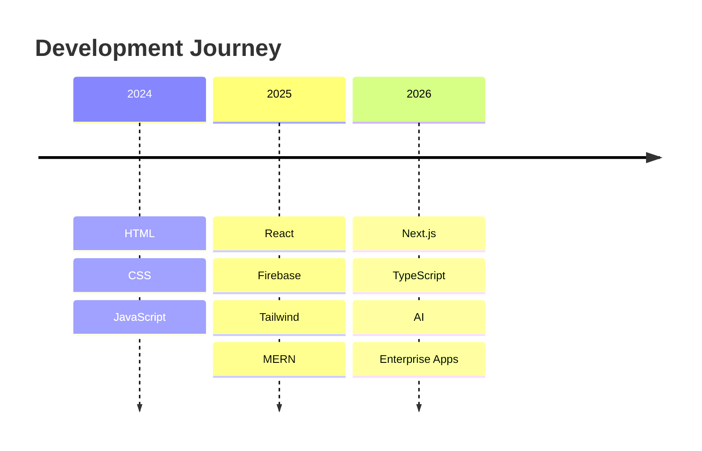
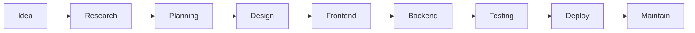

<!-- ========================================================= -->
<!--                 AI OPERATING SYSTEM v3                    -->
<!-- ========================================================= -->

<p align="center">


</p>

<p align="center">


</p>

---

#  Welcome to my AI Developer Operating System

```text
╔══════════════════════════════════════════════════════════════╗
║                                                              ║
║      Artificial Intelligence Developer Console v3.0          ║
║                                                              ║
║      USER           :: Khaled Mahmud                         ║
║      ROLE           :: Full Stack Developer                  ║
║      SPECIALITY     :: MERN Stack & Next.js                  ║
║      LOCATION       :: Bangladesh 🇧🇩                         ║
║      STATUS         :: ONLINE 🟢                             ║
║                                                              ║
╚══════════════════════════════════════════════════════════════╝
```

---

# ⚡ SYSTEM BOOT LOG

```text
[✓] Loading HTML Engine...
[✓] Loading CSS Renderer...
[✓] Initializing JavaScript Runtime...
[✓] React Components Loaded...
[✓] Next.js App Router Connected...
[✓] Express Server Started...
[✓] MongoDB Connected...
[✓] Firebase Initialized...
[✓] Tailwind UI Loaded...
[✓] Framer Motion Enabled...
[✓] Portfolio Ready...
[✓] Developer Online...
```

---

# 🧠 AI STATUS

<table>
<tr>

<td width="50%">

### 👨‍💻 Developer

```yaml
Name:
   Khaled Mahmud

Role:
   Full Stack Web Developer

Focus:
   MERN Stack

Learning:
   Next.js
   TypeScript
   System Design

Current Project:
   Care.xyz

Availability:
   Open for Internship
   Freelance
   Remote Jobs
```

</td>

<td width="50%">


</td>

</tr>
</table>

---

# 🌍 LIVE SYSTEM STATUS

| Module | Status |
|----------|----------|
| 🟢 Frontend | ONLINE |
| 🟢 Backend | ONLINE |
| 🟢 Database | CONNECTED |
| 🟢 API | RUNNING |
| 🟢 Deployment | READY |
| 🟢 Problem Solving | ACTIVE |
| 🟢 Learning Mode | ENABLED |

---

<p align="center">


</p>

---

# 🚀 CURRENT MISSION

```text
Mission Name :

Care.xyz

Objective :

Build scalable,
responsive,
high-performance
web applications
with modern technologies.

Mission Progress

███████████████████████░░░ 95%
```

---

<p align="center">


</p>

---

# ⚙ AI Console

```bash
PS C:\Developer>

whoami

Khaled Mahmud

occupation

Full Stack Developer

stack

React
Next.js
Node.js
Express.js
MongoDB

status

Ready to Build Amazing Things 🚀
```

---

<!-- ================================================= -->
<!--              CYBER DASHBOARD v3                   -->
<!-- ================================================= -->


# ⚡ AI COMMAND CENTER

<table>

<tr>

<td width="50%">

## 🧠 Developer Intelligence

```yaml
Developer:
  Khaled Mahmud

Primary Role:
  Full Stack Developer

Architecture:
  MERN Stack

Frontend:
  React
  Next.js

Backend:
  Node.js
  Express.js

Database:
  MongoDB

Deployment:
  Vercel
  Netlify
  Render

Current Focus:
  Building Production Ready Applications
```

</td>

<td width="50%">

## 🚀 Live Build Queue

```text
□□□□□□□□□□□□□□□□□□□□ 0%

⬜ Planning

■■□□□□□□□□□□□□□□□ 20%

🟦 Designing

■■■■■■□□□□□□□□□□ 45%

🟨 Development

■■■■■■■■■■□□□□□ 70%

🟧 Testing

■■■■■■■■■■■■■■□ 95%

🟩 Deployment
```

</td>

</tr>

</table>

---

# 🌌 DIGITAL CORE

<table>

<tr>

<td align="center">

### ⚛️ Frontend


</td>

<td align="center">

### ⚙ Backend


</td>

</tr>

<tr>

<td align="center">

### 🔧 Tools


</td>

<td align="center">

### 💻 Learning


</td>

</tr>

</table>

---

# 📡 SYSTEM PERFORMANCE

<table>

<tr>

<td width="50%">

### Frontend Engine

```
█████████████████████░░ 95%
```

### Backend Engine

```
███████████████████░░░░ 90%
```

### Database

```
██████████████████░░░░░ 88%
```

### UI / UX

```
█████████████████████░░ 94%
```

</td>

<td width="50%">

### Problem Solving

```
████████████████████░░░ 91%
```

### API Development

```
███████████████████░░░░ 90%
```

### Responsive Design

```
██████████████████████░ 97%
```

### Performance

```
████████████████████░░░ 92%
```

</td>

</tr>

</table>

---

# 🛰 TECH NETWORK

<p align="center">


</p>

---

# ⚡ DEVELOPMENT PIPELINE



---

# 🌍 CURRENT WORKFLOW

```text
┌────────────────────────────────────────────┐

     IDE
      │

      ▼

   React / Next.js

      │

      ▼

Express API

      │

      ▼

MongoDB

      │

      ▼

Deployment

(Vercel / Netlify)

└────────────────────────────────────────────┘
```

---

# 💻 TERMINAL STATUS

```bash
PS C:\Projects>

dir

Care.xyz

ZapShift

Hero App

Job Tracker

AI Chatbot

Portfolio

status

✔ All Projects Synced Successfully.
```

---

<p align="center">


</p>

<!-- ================================================= -->
<!--            FEATURED PROJECTS : PART 3A            -->
<!-- ================================================= -->


# 🚀 FEATURED PROJECTS

<p align="center">

<b>Projects that showcase my passion for building modern, scalable and user-focused applications.</b>

</p>

---

<table>

<tr>

<td width="50%">

# 💙 Care.xyz

Modern Care Service Platform

### Stack

Next.js

React

Tailwind CSS

Framer Motion

SweetAlert2

Firebase

### Features

✔ Authentication

✔ Private Routes

✔ Dynamic Booking

✔ Responsive UI

✔ Metadata SEO

✔ Animated Components

✔ Booking Dashboard

</td>

<td width="50%">

```text
PROJECT STATUS

█████████████████████░░

95%

READY FOR PRODUCTION
```

</td>

</tr>

</table>

---

<table>

<tr>

<td width="50%">

# 💼 Job Tracker

Track and organize job applications.

### Features

✔ Dashboard

✔ CRUD

✔ Charts

✔ Responsive

✔ Local Storage

✔ Modern UI

</td>

<td width="50%">

```text
PROJECT STATUS

████████████████████░░░

90%

ACTIVE
```

</td>

</tr>

</table>

---

<table>

<tr>

<td width="50%">

# 🦸 Hero App

Interactive Hero Explorer

### Features

✔ Hero Profiles

✔ Routing

✔ Responsive

✔ Filtering

✔ Modern Design

</td>

<td width="50%">

```text
PROJECT STATUS

██████████████████████░

96%

DEPLOYED
```

</td>

</tr>

</table>

---

# 🛰 PROJECT MISSION CONTROL



---

# ⚡ PROJECT PHILOSOPHY

```text

I don't just build websites.

I engineer experiences.

Every project focuses on

• Performance

• Scalability

• Accessibility

• Clean Architecture

• Beautiful UI

• Maintainability

```

---

# 📂 DEVELOPMENT ROADMAP

```text

2024

HTML

CSS

JavaScript

↓

React

↓

Firebase

↓

Tailwind

↓

Node.js

↓

Express

↓

MongoDB

↓

Next.js

↓

TypeScript

↓

System Design

↓

AI Integration

```

---

<p align="center">


</p>

<!-- ================================================= -->
<!--           FEATURED PROJECT SPOTLIGHT              -->
<!-- ================================================= -->


# 🌟 FEATURED PROJECT SPOTLIGHT

<table>

<tr>

<td width="40%" align="center">


</td>

<td width="60%">

## 💙 Care.xyz

### Modern Care Service Platform

```text
STATUS

█████████████████████░░

95%
```

### Core Features

✔ Authentication

✔ Google Login

✔ Dynamic Booking

✔ Private Route

✔ Responsive UI

✔ SweetAlert

✔ Framer Motion

✔ Dashboard

✔ SEO Metadata

✔ Email Invoice Ready

</td>

</tr>

</table>

---

# 🚀 PROJECT COMMAND CENTER

<table>

<tr>

<td align="center">

### ⚛ Frontend

React

Next.js

Tailwind CSS

Framer Motion

</td>

<td align="center">

### ⚙ Backend

Node.js

Express.js

MongoDB

Firebase

</td>

<td align="center">

### 🚀 Deployment

Vercel

Netlify

Render

GitHub

</td>

</tr>

</table>

---

# 📦 FEATURED REPOSITORIES

| Project | Status | Stack |
|----------|--------|-------|
| 💙 Care.xyz | 🟢 Production | Next.js |
| 💼 Job Tracker | 🟢 Stable | React |
| 🦸 Hero App | 🟢 Live | React Router |
| 🤖 AI Chat | 🟡 Development | MERN |

---

# 🌠 PROJECT EVOLUTION



---

# 💎 PROJECT GOALS

```text

✓ Beautiful UI

✓ High Performance

✓ Secure Authentication

✓ Responsive Design

✓ Accessibility

✓ Maintainable Code

✓ Reusable Components

✓ Production Ready Architecture

```

---

# ⚡ CURRENT BUILD

```text

████████████████████░░

Currently Building

↓

Care.xyz

↓

Next.js

↓

Production Mode

```

---

<p align="center">


</p>

<!-- ================================================= -->
<!--                PART 4 : AI CORE                  -->
<!-- ================================================= -->


# 🤖 AI CORE SYSTEM

<p align="center">

### Every line of code has a purpose.

### Every project solves a real problem.

### Every day is another opportunity to improve.

</p>

---

# ⚡ SYSTEM STATUS

<table align="center">

<tr>

<td align="center">

## 🟢

System

ONLINE

</td>

<td align="center">

## 🚀

Development

ACTIVE

</td>

<td align="center">

## ☕

Coffee

READY

</td>

<td align="center">

## 💻

Coding

24/7

</td>

</tr>

</table>

---

# 🧠 AI KNOWLEDGE MATRIX

| Category | Level |
|-----------|-------|
| HTML | ████████████████████ 100% |
| CSS | ███████████████████░ 95% |
| JavaScript | ██████████████████░░ 92% |
| React | ██████████████████░░ 90% |
| Next.js | █████████████████░░░ 88% |
| Tailwind | ████████████████████ 100% |
| Node.js | ████████████████░░░░ 85% |
| Express | ████████████████░░░░ 84% |
| MongoDB | ███████████████░░░░░ 82% |
| Firebase | █████████████████░░░ 87% |

---

# 🌍 DEVELOPER MINDSET

```text
while(alive){

 Learn();

 Build();

 Improve();

 Repeat();

}
```

---

# 📈 GROWTH ENGINE

```mermaid

mindmap

root((Khaled))

Frontend

React

Next.js

Tailwind

Backend

Node

Express

Database

MongoDB

Firebase

Soft Skills

Leadership

Communication

Problem Solving

Future

AI

System Design

Cloud

```

---

# 💡 CURRENT MISSION

```text

MISSION

━━━━━━━━━━━━━━━━━━━━━━

Build products that people actually love.

━━━━━━━━━━━━━━━━━━━━━━

```

---

# 🛰 DEVELOPMENT PIPELINE



---

# ⚙ WORKFLOW

```text

PLAN

↓

DESIGN

↓

BUILD

↓

TEST

↓

OPTIMIZE

↓

DEPLOY

↓

IMPROVE

```

---

# 🌌 DEVELOPMENT PRINCIPLES

✔ Clean Code

✔ Reusable Components

✔ Responsive Design

✔ Accessibility

✔ Performance

✔ Security

✔ Scalability

✔ User Experience

---

<p align="center">


</p>

<!-- ================================================= -->
<!--            PART 5A : AI OPERATING SYSTEM          -->
<!-- ================================================= -->


# 🛰 AI OPERATING SYSTEM

```text
╔══════════════════════════════════════════════════════════════╗
║                                                              ║
║              CAREFULLY SCANNING DEVELOPER...                 ║
║                                                              ║
╚══════════════════════════════════════════════════════════════╝
```

```text
> Boot Sequence Started...

████████████████████████████████████████ 100%

✔ CPU Connected
✔ Memory Loaded
✔ Neural Network Ready
✔ Developer Identity Verified
✔ GitHub Node Connected
✔ Portfolio Loaded
✔ Repository Indexed

STATUS : ONLINE
```

---

# 🧠 DEVELOPER PROFILE

```yaml
name:
    Khaled Mahmud

role:
    Full Stack Web Developer

specialization:
    MERN Stack

frontend:
    React
    Next.js
    Tailwind CSS

backend:
    Node.js
    Express.js

database:
    MongoDB

authentication:
    Firebase

current_focus:
    Next.js Architecture
    Backend Scalability
    Clean Code

goal:
    Build Production Grade Applications
```

---

# ⚡ LIVE SYSTEM MONITOR

```text

CPU

██████████████████░░░░ 89%

Problem Solving

████████████████████░░ 95%

Creativity

███████████████████░░░ 91%

Learning Speed

██████████████████████ 98%

Coffee Level

████████████████░░░░░░ 80%

Sleep

█████░░░░░░░░░░░░░░░░░ 25%

```

---

# 🌌 ACTIVE SERVICES

| Service | Status |
|----------|--------|
| 🌐 Portfolio | 🟢 Running |
| ⚛ React Engine | 🟢 Running |
| 🔥 Firebase | 🟢 Connected |
| 🍃 MongoDB | 🟢 Connected |
| 🚀 Next.js | 🟢 Running |
| 📦 API Server | 🟢 Stable |
| 🔒 Authentication | 🟢 Active |
| 📊 Analytics | 🟢 Monitoring |

---

# 📡 COMMAND TERMINAL

```bash
$ whoami

Khaled Mahmud

$ profession

Full Stack Web Developer

$ favorite_stack

MERN Stack

$ current_learning

Next.js
TypeScript
Advanced Backend

$ future

AI Integration
Cloud Computing
System Design
```

---

# 🛰 SERVER LOGS

```text

[08:00] Server Started

[08:02] Loading Components...

[08:03] React Initialized

[08:05] MongoDB Connected

[08:06] Firebase Connected

[08:08] Building Amazing UI...

[08:10] Deployment Successful

[08:11] Waiting For Next Challenge...

```

---

# ⚙ DEVELOPER VALUES

```text
✔ Write Clean Code

✔ Build Scalable Systems

✔ Learn Every Day

✔ Solve Real Problems

✔ Never Stop Improving

✔ User Experience First

✔ Responsive By Default

✔ Keep Everything Simple

```

---

<p align="center">

████████████████████████████████████████████████

SYSTEM STATUS : READY

████████████████████████████████████████████████

</p>


<!-- ================================================= -->
<!--         PART 5B : DEVELOPER INTELLIGENCE          -->
<!-- ================================================= -->


# 🧬 DEVELOPER DNA REPORT

```text
╭────────────────────────────────────────────────────────────╮
│               DEVELOPER GENETIC ANALYSIS                   │
├────────────────────────────────────────────────────────────┤
│ Creativity            ████████████████████ 96%             │
│ Problem Solving       ███████████████████  94%             │
│ UI Design             ██████████████████   90%             │
│ Backend Logic         █████████████████    87%             │
│ Database Design       ████████████████     84%             │
│ API Development       █████████████████    88%             │
│ Debugging             ███████████████████  93%             │
│ Team Collaboration    █████████████████    89%             │
╰────────────────────────────────────────────────────────────╯
```

---

# 🛰 MISSION ARCHIVE

| Mission | Result |
|---------|--------|
| 🚀 Learn HTML | ✅ Completed |
| 🎨 Master CSS | ✅ Completed |
| ⚡ JavaScript Fundamentals | ✅ Completed |
| ⚛ React Development | ✅ Completed |
| 🔥 Firebase Authentication | ✅ Completed |
| 🍃 MongoDB Database | ✅ Completed |
| 🌐 REST API | ✅ Completed |
| 💼 MERN Projects | ✅ Completed |
| ▲ Next.js Journey | 🚧 In Progress |
| 🤖 AI Integration | 🎯 Next Mission |

---

# 🧠 THINKING ENGINE

```text
Receive Problem
       │
       ▼
Analyze Carefully
       │
       ▼
Research Best Practice
       │
       ▼
Break Into Small Tasks
       │
       ▼
Write Clean Code
       │
       ▼
Test Everything
       │
       ▼
Optimize Performance
       │
       ▼
Deploy 🚀
```

---

# 🏆 ACHIEVEMENT TERMINAL

```text
[✓] Responsive Website Builder

[✓] REST API Developer

[✓] Firebase Authentication

[✓] MongoDB CRUD Operations

[✓] Full Stack MERN Projects

[✓] Modern UI Designer

[✓] Deployment Experience

[ ] AI Powered SaaS

[ ] Microservices

[ ] AWS Cloud

[ ] Kubernetes

```

---

# 🌌 CURRENT OPERATIONS

```text
███████████████████████████████

STATUS : BUILDING

PROJECT : Care.xyz

MODE : PRODUCTION

FRAMEWORK : Next.js

DATABASE : MongoDB

AUTH : Firebase

███████████████████████████████
```

---

# ⚡ ENGINEERING PHILOSOPHY

```text
"Good developers write code.

Great developers solve problems.

The best developers create experiences."
```

---

# 📂 ACTIVE MODULES

```yaml
frontend:
  - React
  - Next.js
  - Tailwind CSS
  - Framer Motion

backend:
  - Node.js
  - Express.js

database:
  - MongoDB

authentication:
  - Firebase Auth

deployment:
  - Vercel
  - Netlify
  - Render

tools:
  - Git
  - GitHub
  - VS Code
  - Postman
```

---

# 🎯 NEXT TARGETS

```text
□ TypeScript Mastery

□ Advanced Next.js

□ System Design

□ Docker

□ CI/CD Pipelines

□ Cloud Deployment

□ AI API Integration

□ Enterprise Applications
```

---

# 📡 TRANSMISSION STATUS

```text
Incoming Recruiter...
██████████████████████ 100%

Portfolio ............ READY

Projects ............. READY

GitHub ............... READY

Open For Opportunities ✓
```


<!-- ================================================= -->
<!--              PART 6A : SKILL MATRIX               -->
<!-- ================================================= -->


# 🌌 DEVELOPER SKILL TREE

```text
                            👨‍💻 KHALED MAHMUD
                                     │
         ┌───────────────────────────┼───────────────────────────┐
         │                           │                           │
         ▼                           ▼                           ▼
    🎨 Frontend                 ⚙ Backend                  🗄 Database
         │                           │                           │
         ├── HTML5                   ├── Node.js                ├── MongoDB
         ├── CSS3                    ├── Express.js            ├── Mongoose
         ├── JavaScript              ├── REST API              └── CRUD
         ├── React                   ├── JWT
         ├── Next.js                 └── Middleware
         ├── Tailwind CSS
         └── Framer Motion
```

---

# 📊 TECHNOLOGY POWER LEVEL

| Technology | Power |
|------------|------:|
| HTML5 | ████████████████████ 100% |
| CSS3 | ███████████████████ 95% |
| JavaScript | ██████████████████ 92% |
| React | ██████████████████ 91% |
| Next.js | ████████████████ 82% |
| Tailwind CSS | ███████████████████ 96% |
| Node.js | █████████████████ 87% |
| Express.js | ████████████████ 84% |
| MongoDB | ████████████████ 85% |
| Firebase | █████████████████ 89% |

---

# 🚀 PROJECT EXPERIENCE MATRIX

```text
Portfolio Website        ████████████████████

Restaurant Website       ██████████████████

Job Tracker              █████████████████

Care.xyz                 ███████████████

Authentication System    ███████████████

CRUD Operations          ██████████████████

REST API                 █████████████████

Responsive Design        ████████████████████
```

---

# 🧠 AI KNOWLEDGE SCAN

```yaml
Languages:
  ✔ HTML
  ✔ CSS
  ✔ JavaScript

Frontend:
  ✔ React
  ✔ Next.js
  ✔ Tailwind CSS
  ✔ DaisyUI

Backend:
  ✔ Node.js
  ✔ Express.js

Database:
  ✔ MongoDB

Authentication:
  ✔ Firebase Auth
  ✔ JWT (Learning & Practice)

Tools:
  ✔ Git
  ✔ GitHub
  ✔ VS Code
  ✔ Postman

Deployment:
  ✔ Vercel
  ✔ Netlify
  ✔ Render
```

---

# 📈 MISSION PROGRESS

```text
Learn HTML                 ████████████████████ 100%

Learn CSS                  ████████████████████ 100%

Learn JavaScript           ███████████████████░ 95%

Learn React                ██████████████████░░ 90%

Learn Next.js              ███████████████░░░░░ 80%

Backend Development        █████████████████░░░ 88%

Database                   █████████████████░░░ 86%

Deployment                 ███████████████████░ 94%
```

---

# 🎯 CURRENT OBJECTIVES

- 🚀 Build scalable Full Stack applications
- ⚛ Master Next.js App Router
- 🧠 Improve System Design knowledge
- ☁ Learn Cloud deployment
- 🤖 Integrate AI into real-world applications
- 💼 Secure a professional Software Engineer role

---

<p align="center">

```text
██████████████████████████████████████████████

        STATUS : CONTINUOUS LEARNING

██████████████████████████████████████████████
```

</p>


<!-- ================================================= -->
<!--          PART 6B : CYBER COMMAND CENTER           -->
<!-- ================================================= -->


# 🛰 CYBER COMMAND CENTER

```text
╔══════════════════════════════════════════════════════════════╗
║                  DEVELOPER CONTROL PANEL                    ║
╠══════════════════════════════════════════════════════════════╣
║ 👤 User              : Khaled Mahmud                        ║
║ 💼 Role              : Full Stack Web Developer            ║
║ 🌍 Region            : Bangladesh                          ║
║ ⚛ Primary Stack      : MERN + Next.js                     ║
║ 🚀 Status            : Open For Opportunities             ║
║ 📡 System            : Stable                             ║
║ 🔒 Security          : Authentication Enabled             ║
║ ⚡ Performance       : Excellent                          ║
╚══════════════════════════════════════════════════════════════╝
```

---

# ⚡ RECRUITER SNAPSHOT

| Question | Answer |
|-----------|--------|
| 👨‍💻 Full Stack Developer? | ✅ Yes |
| 📱 Responsive UI? | ✅ Yes |
| 🔐 Authentication? | ✅ Firebase / JWT |
| 🛠 REST API? | ✅ Yes |
| 🍃 MongoDB? | ✅ Yes |
| ⚛ React? | ✅ Yes |
| ▲ Next.js? | ✅ Yes |
| 🚀 Deployment? | ✅ Yes |
| 🎨 Modern UI? | ✅ Yes |
| 📦 Clean Code? | ✅ Always |

---

# 📅 DEVELOPER TIMELINE

```text
2024
│
├── HTML
├── CSS
├── JavaScript
│
2025
│
├── React
├── Tailwind CSS
├── Firebase
├── MongoDB
│
2026
│
├── Next.js
├── Full Stack Projects
├── REST APIs
├── Authentication
│
NEXT
│
├── TypeScript
├── AI Integration
├── Docker
├── Cloud
└── System Design
```

---

# 🏆 ACHIEVEMENT WALL

```text
🏅 Built Responsive Websites

🏅 Created MERN Stack Applications

🏅 Implemented Firebase Authentication

🏅 Connected MongoDB Database

🏅 Designed Modern User Interfaces

🏅 Built CRUD Applications

🏅 Completed Multiple Academic Projects

🏅 Continuously Learning New Technologies
```

---

# 📂 FEATURE MODULES

```yaml
UI:
  ✔ Responsive
  ✔ Modern
  ✔ Animated

Authentication:
  ✔ Register
  ✔ Login
  ✔ Logout

Booking System:
  ✔ Dynamic Cost
  ✔ Booking Status
  ✔ Local Storage

Database Ready:
  ✔ MongoDB
  ✔ Firebase

Deployment:
  ✔ Vercel
  ✔ Netlify
```

---

# 💻 LIVE TERMINAL

```bash
> npm run dev

✔ Starting development server...

✔ React Loaded

✔ Next.js Running

✔ MongoDB Connected

✔ Firebase Initialized

✔ Tailwind Compiled

✔ Everything Looks Good 🚀
```

---

# 🌍 CURRENT MISSION

```text
MISSION NAME

Become a World-Class Software Engineer

MISSION STATUS

███████████████████░░░ 92%

NEXT CHECKPOINT

✔ TypeScript
✔ Docker
✔ Cloud
✔ AI
✔ Enterprise Development
```

---

# 📡 FINAL SYSTEM CHECK

```text
Repository ............. READY

Portfolio .............. READY

Projects ............... READY

Learning ............... ACTIVE

Motivation ............. MAXIMUM

Coffee ................. REFILLED ☕

Everything is operational.
```


<!-- ================================================= -->
<!--              PART 7 : DIGITAL IDENTITY            -->
<!-- ================================================= -->


# 🪪 DIGITAL DEVELOPER ID

```text
╔════════════════════════════════════════════════════════════╗
║                    DIGITAL IDENTITY CARD                 ║
╠════════════════════════════════════════════════════════════╣
║ Name        : Khaled Mahmud                              ║
║ Role        : Full Stack Web Developer                   ║
║ Stack       : MERN + Next.js                             ║
║ Country     : Bangladesh 🇧🇩                              ║
║ Experience  : Building Modern Web Apps                   ║
║ Status      : Open For Work                              ║
║ Version     : Developer v2.6                             ║
╚════════════════════════════════════════════════════════════╝
```

---

# 🧠 ENGINEERING PRINCIPLES

```text
✔ Clean Code over Clever Code

✔ Performance over Complexity

✔ Simplicity over Noise

✔ Security over Convenience

✔ User Experience over Everything
```

---

# 🌌 SKILL CONSTELLATION

```text

                    ★ Next.js

          ★ React                ★ MongoDB


   ★ Tailwind                        ★ Firebase


          ★ JavaScript       ★ Express


                 ★ Node.js

```

---

# ⚡ DAILY DEVELOPMENT LOOP

```text

Receive Idea
     │
     ▼
Research
     │
     ▼
Design
     │
     ▼
Code
     │
     ▼
Debug
     │
     ▼
Optimize
     │
     ▼
Deploy 🚀

```

---

# 🎮 DEVELOPER CHARACTER

```yaml
Name: Khaled Mahmud

Class: Full Stack Developer

Level: 26

Special Ability:
  - Clean UI
  - REST APIs
  - Authentication
  - Database Design

Passive Skill:
  - Fast Learner

Ultimate Skill:
  - Build Complete MERN Applications
```

---

# 🌍 EXPLORED TECHNOLOGIES

```text
Frontend

██████████████████████████

Backend

█████████████████████

Database

███████████████████

Deployment

████████████████████

Problem Solving

███████████████████████
```

---

# 🛰 SYSTEM LOG

```text
[ OK ] HTML Module Loaded

[ OK ] CSS Module Loaded

[ OK ] JavaScript Loaded

[ OK ] React Initialized

[ OK ] Next.js Booted

[ OK ] MongoDB Connected

[ OK ] Firebase Connected

[ OK ] APIs Responding

[ OK ] Deployment Successful

SYSTEM STATUS

████████████████████

ONLINE
```

---

# 💡 FOCUS AREAS

- ⚛ Next.js Architecture
- 🚀 Performance Optimization
- 🔐 Secure Authentication
- 📦 REST API Design
- 🤖 AI Integration
- ☁ Cloud Deployment
- 🧩 Scalable Applications

---

# 📡 TRANSMISSION COMPLETE

```text

█████████████████████████████████████████████

Thanks for visiting my GitHub Profile.

Have an amazing day.

█████████████████████████████████████████████

```


